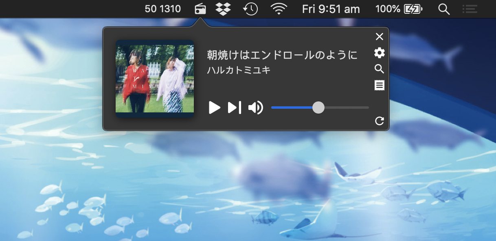
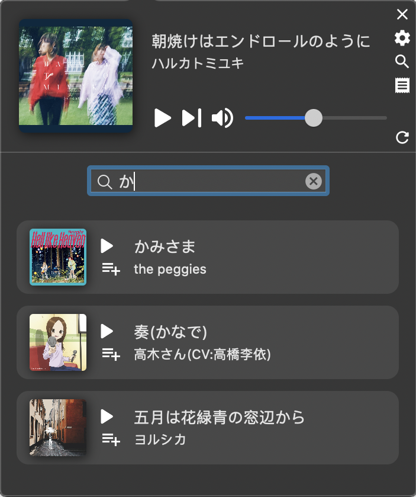
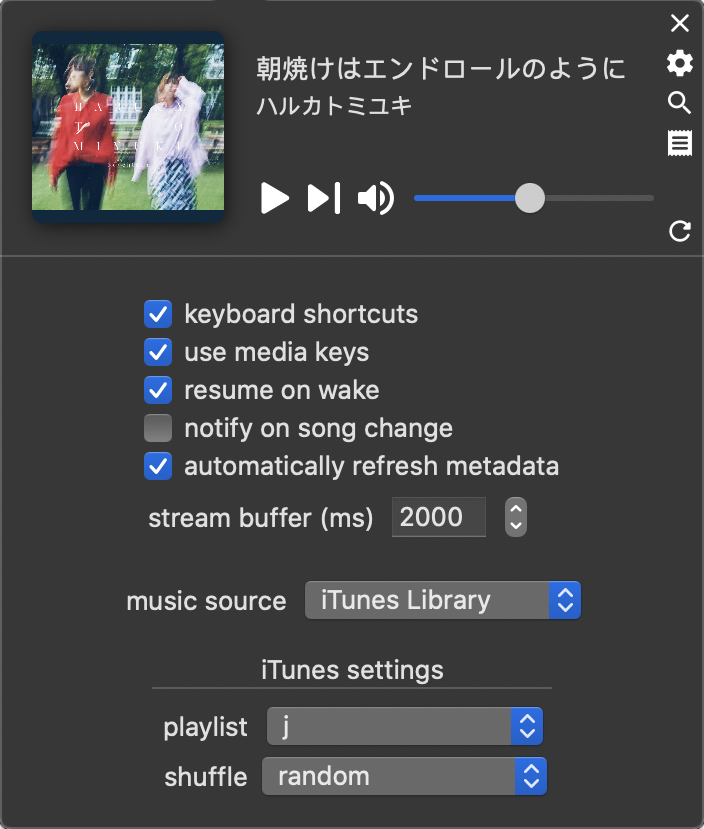
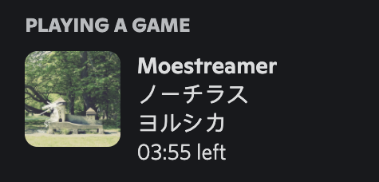

# MoeStreamer

A tiny macOS app that sits in the menubar, to stream music from [LISTEN.moe](https://listen.moe). It also lets you play local playlists from iTunes (or Music.app — same thing).

## Features

1. Streaming from LISTEN.moe, including (un)favouriting when logged in
2. Playback from local iTunes (Music.app) library
3. Search for local music
4. *ALWAYS* overrides media keys (F7-F9, or touchbar buttons) when the app is open.
5. Discord presence, including cover art

When logging in to LISTEN.moe, the account password is stored in the macOS Keychain.

## Screenshots

Here's how it looks like in the menubar:
<div style="text-align: center">

</div>

Search view:
<div style="text-align: center">

</div>

Settings view:
<div style="text-align: center">

</div>


## Keyboard Shortcuts
At the moment, these shortcuts cannot be customised.

|  function   |              key               |
|-------------|--------------------------------|
|play / pause | <kbd>K</kbd>, <kbd>space</kbd> |
| next song   |          <kbd>L</kbd>          |
| (un)mute    |          <kbd>M</kbd>          |
|   search    |          <kbd>/</kbd>          |
|(un)favourite|          <kbd>F</kbd>          |


## Building
```
$ carthage update --platform macos
$ xcodebuild
```

Alternatively, open the Xcode project and build it there (you still need to run `carthage`).


## Discord Presence

This app includes support for updating your discord presence, looking something like this:

<div style="text-align: center">

</div>

If you only need the song information (title, artist) to appear, then you don't need to do anything other than check the tickbox. If you want album art to appear however, read further.

As a small easter egg, if you are listening to any albums that I (the app developer) have images for, then you'll get free cover art without needing to do any work! The authorisation stuff below (tokens etc.) is only needed to *upload* new art. 

### obtaining your token

In order to use this feature, create an application on the [Discord Developer Portal](https://discord.com/developers/applications), and note
down your Application ID (this is not a secret).

Next, open up your browser web inspector, and fish out the `Authorization` header from any of the request headers. It should start with `mfa.`. Probably. This is your *token*, and it is a secret. I am well aware that this is an account token and not an application token, but I'm too lazy to implement a proper OAuth flow.

Alternatively, you can select "automatically extract token" in the settings, and the app will attempt to find your token from a local running instance of Discord. This doesn't always work, though. Regardless of which method you choose, the token seems to expire after a while, so if you notice that your album arts are not updating, repeat the steps above to get a new token. 


### managing album art

Discord applications can have at most 150 assets, which means you can only have 150 album art images "available" at a time. If the current song's art does not exist on the server, then it is uploaded (and other victim images are purged to keep below the 150 limit).

If you are reading this far, then you have already created a discord app; upload an image and name it `default-cover` to serve as the default in case anything goes wrong (note: this is not necessary if you are not using your own application).


## License

Contributions from `my_cat_is_ugly` on Twitch.

Code is licensed under the Apache License Version 2.
Icons are from Google's [material.io](https://material.io/resources/icons/), which are similarly licensed.

App icon is gotten from [here](https://old.reddit.com/r/pouts/comments/d1p2ua)
