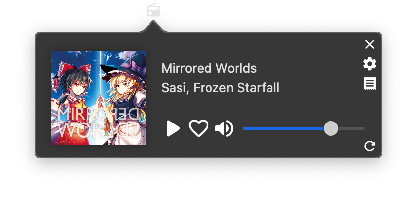

# MoeStreamer

A tiny macOS app that sits in the menubar, to stream music from [LISTEN.moe](https://listen.moe). It also lets you play local playlists from iTunes (or Music.app -- same thing).

# Screenshot

# License

Code is licensed under the Apache License Version 2.
Icons are from Google's [material.io](https://material.io/resources/icons/), which are similarly licensed.

App icon is gotten from [here](https://old.reddit.com/r/pouts/comments/d1p2ua)
`external/CircularBuffer.swift` yoinked from SwiftNIO project. Also Apache 2.0 licensed.
